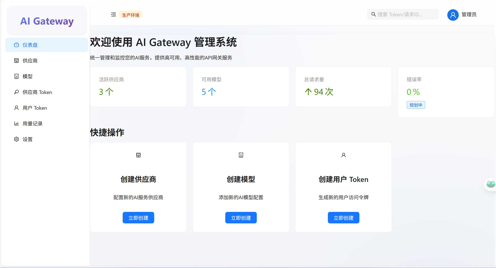
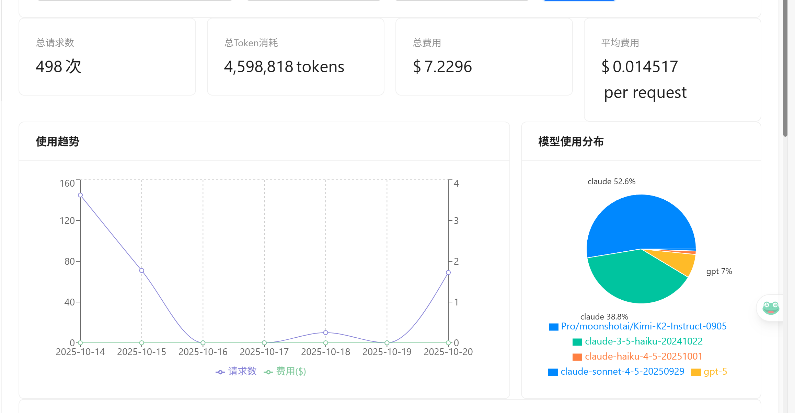

# AxonGate - 高性能 AI 模型网关

> 企业级 AI 模型路由与协议转换网关，支持 OpenAI 与 Anthropic 协议无缝切换

[](LICENSE)
[](docker-compose.yml)
[](https://github.com/sunSprout/axongate/stargazers)

---

## 📖 项目简介

AxonGate 是一个采用微服务架构的高性能 AI 模型网关系统，专为企业级应用设计。它提供统一的 API 入口，自动处理不同 LLM 服务商之间的协议转换，并内置完善的权限管理、请求追踪和性能监控能力。

### 核心组件

| 组件                                                       | 技术栈                          | 许可证       | 仓库                                                            |
| ---------------------------------------------------------- | ------------------------------- | ------------ | --------------------------------------------------------------- |
| **Backend**                                                | Go + Gin + Ent                  | 专有（闭源） | -                                                               |
| **[Engine](https://github.com/sunSprout/axongate-engine)** | Rust + Axum + Tokio             | Apache-2.0   | [axongate-engine](https://github.com/sunSprout/axongate-engine) |
| **[UI](https://github.com/sunSprout/axongate-ui)**         | React + TypeScript + Ant Design | MIT          | [axongate-ui](https://github.com/sunSprout/axongate-ui)         |

---

## ✨ 核心特性

- 🚀 **协议自动转换** - OpenAI ↔ Anthropic 双向转换，客户端无感知
- ⚡ **高性能引擎** - Rust 实现的代理引擎，内存缓存策略，毫秒级响应
- 🔐 **企业级安全** - RBAC 权限管理，API 密钥加密存储
- 📊 **使用监控** - 请求事件上报，使用量统计分析，健康检查
- 🔄 **请求重试** - 自动重试机制，提升请求成功率
- 🐳 **容器化部署** - 一键启动，开箱即用

---

## 📸 界面预览

### 登录与仪表盘

<table>
  <tr>
    <td align="center">
      
      <br/>
      <b>登录页面</b>
      <br/>
      简洁美观的登录界面，支持用户身份认证
    </td>
  </tr>
  <tr>
    <td align="center">
      
      <br/>
      <b>仪表盘主页</b>
      <br/>
      一目了然的系统概览，提供活跃供应商、可用模型、请求统计等关键指标
    </td>
  </tr>
</table>

### 配置管理

<table>
  <tr>
    <td align="center">
      
      <br/>
      <b>供应商管理</b>
      <br/>
      管理 AI 模型供应商配置，支持 OpenAI、Anthropic 等多种服务商
    </td>
  </tr>
  <tr>
    <td align="center">
      
      <br/>
      <b>模型管理</b>
      <br/>
      配置 AI 模型参数，设置价格和状态，灵活管理模型资源
    </td>
  </tr>
  <tr>
    <td align="center">
      
      <br/>
      <b>供应商 Token 管理</b>
      <br/>
      安全管理各供应商的 API 密钥，支持加密存储和健康检测
    </td>
  </tr>
</table>

### 访问控制

<table>
  <tr>
    <td align="center">
      
      <br/>
      <b>用户 Token 管理</b>
      <br/>
      生成和管理 API 访问令牌，控制系统访问权限和速率限制
    </td>
  </tr>
</table>

### 监控与分析

<table>
  <tr>
    <td align="center">
      
      <br/>
      <b>使用统计与分析</b>
      <br/>
      实时追踪请求数、Token 消耗、费用统计和模型使用分布
    </td>
  </tr>
</table>

### 系统设置

<table>
  <tr>
    <td align="center">
      
      <br/>
      <b>个人设置</b>
      <br/>
      管理个人信息和系统配置，包括安全设置和系统参数
    </td>
  </tr>
</table>

---

## 🚀 快速启动

### 前置要求

- Docker 20.10+
- Docker Compose 2.0+
- Git
- 4GB+ 可用内存

### 安装步骤

```bash
# 1. 克隆仓库
# 推荐使用 HTTPS（无需配置 SSH 密钥）
git clone https://github.com/sunSprout/axongate.git
cd axongate

# 如果使用 SSH（需要配置 GitHub SSH 密钥）
# git clone git@github.com:sunSprout/axongate.git

# 2. 初始化环境（自动克隆开源组件 + 创建配置目录）
sudo ./scripts/init.sh

# 3. 配置环境变量
cp .env.example .env
nano .env  # 修改 POSTGRES_PASSWORD 等敏感配置

# 4. 启动所有服务（首次启动约需 5-10 分钟构建镜像）
docker compose up -d

# 5. 检查服务状态
./scripts/health-check.sh
```

#### 💡 说明

- **自动化部署**：`init.sh` 脚本会自动检查并克隆 `axongate-engine` 和 `axongate-ui` 仓库
- **无需 submodule**：不需要使用 `git clone --recursive`，部署更简单
- **支持更新**：如需更新开源组件，删除对应目录后重新运行 `init.sh`

### 访问地址

| 服务     | 地址                                     | 说明                                       |
| -------- | ---------------------------------------- | ------------------------------------------ |
| 管理面板 | http://localhost:8080                    | **推荐** Web UI 管理界面（HTTP，无需证书） |
| 管理面板 | https://localhost:443                    | HTTPS 访问（自签名证书，浏览器会警告）     |
| API 文档 | http://localhost:8080/swagger/index.html | Swagger API 文档                           |
| 健康检查 | http://localhost:8080/health             | 服务健康状态                               |

#### 💡 证书说明

本项目提供**三种访问方式**：

1. **HTTP 方式（推荐本地测试）**
   - 地址：`http://localhost:8080`
   - 无需证书，浏览器直接访问
   - 适合：本地开发、测试环境

2. **HTTPS 自签名证书方式**
   - 地址：`https://localhost:443`
   - 使用预置自签名证书（`config/certs/`）
   - 浏览器会显示"不安全"警告（正常现象，可信任继续访问）
   - 适合：本地 HTTPS 功能测试

3. **HTTPS 自动证书方式（生产环境）**
   - 配置真实域名后，Caddy 自动申请 Let's Encrypt 证书
   - 需要：公网可访问的域名 + DNS 解析
   - 适合：生产部署

### 默认账户

- **用户名**：`admin`
- **密码**：`admin123`

⚠️ **安全提示**：首次登录后请立即修改默认密码！

---

## 🏗️ 架构设计

```
┌─────────────────────────────────────────────────────────────┐
│                         用户/应用                            │
└─────────────────────────┬───────────────────────────────────┘
                          │
                          ▼
                    ┌──────────┐
                    │  Caddy   │ (反向代理 + 前端静态文件)
                    └─────┬────┘
                          │
         ┌────────────────┼────────────────┐
         ▼                                 ▼
   ┌──────────┐                      ┌──────────┐
   │ Backend  │ (Go, 闭源)           │  Engine  │ (Rust, 开源)
   │          │◄─────────────────────│          │
   │ - 用户管理                       │ - 协议转换│
   │ - 权限控制                       │ - 请求重试│
   │ - 配置管理                       │ - 内存缓存│
   └─────┬────┘                      └──────────┘
         │
         ▼
   ┌──────────┐
   │PostgreSQL│ (数据持久化)
   └──────────┘
```

详细架构说明请参阅 [docs/architecture.md](docs/architecture.md)

### 当前实现特性

| 模块         | 已实现功能                         | 实现位置                                    |
| ------------ | ---------------------------------- | ------------------------------------------- |
| **协议转换** | ✅ OpenAI ↔ Anthropic 双向转换      | `ai-gateway-engine/src/protocol/`           |
| **缓存策略** | ✅ 单层内存缓存 (DashMap + 滑动TTL) | `ai-gateway-engine/src/cache/mod.rs`        |
| **请求处理** | ✅ 自动重试机制 (失败重试)          | `ai-gateway-engine/src/router/mod.rs`       |
| **使用统计** | ✅ 请求数、Token 消耗、费用统计     | `backend/internal/service/usage_service.go` |
| **权限管理** | ✅ RBAC 权限控制 (Casbin)           | `backend/internal/service/auth/`            |
| **遥测上报** | ✅ 请求事件与错误上报               | `ai-gateway-engine/src/telemetry/mod.rs`    |
| **健康检查** | ✅ 服务健康状态检测                 | `backend/internal/server/`                  |

---

## 📚 文档

| 文档                                | 说明                 |
| ----------------------------------- | -------------------- |
| [部署指南](docs/deployment.md)      | 生产环境部署详细步骤 |
| [配置说明](docs/configuration.md)   | 所有配置项详解       |
| [架构设计](docs/architecture.md)    | 系统架构与组件说明   |
| [故障排查](docs/troubleshooting.md) | 常见问题与解决方案   |

---

## 🔧 常用操作

### 更新开源组件

```bash
# 更新 Engine 和 UI 到最新版本
./scripts/update-submodules.sh

# 重新构建镜像
docker-compose build engine caddy

# 重启服务
docker-compose up -d
```

### 数据备份

```bash
# 备份 PostgreSQL 数据库
sudo ./scripts/backup.sh

# 恢复备份（示例）
gunzip -c /opt/axongate/backups/axongate_backup_20250101_120000.sql.gz | \
  docker exec -i axongate-postgres psql -U postgres ai_proxy
```

### 查看日志

```bash
# 查看所有服务日志
docker-compose logs -f

# 查看特定服务日志
docker-compose logs -f backend
docker-compose logs -f engine
docker-compose logs -f caddy
```

### 停止服务

```bash
# 停止所有服务
docker-compose down

# 停止并删除所有数据（危险操作！）
docker-compose down -v
```

---

## 🤝 开源与商业

AxonGate 采用 **混合许可模式**：

- **Backend（闭源）** - 核心业务逻辑，提供商业支持和定制化服务
- **Engine（开源）** - Apache-2.0 许可，欢迎社区贡献
- **UI（开源）** - MIT 许可，可自由修改和分发

开源组件接受 Pull Requests！贡献指南请参阅各组件仓库。

---

## 💬 技术支持

- 🐛 **问题反馈**：[GitHub Issues](https://github.com/sunSprout/axongate/issues)
- 📧 **商业支持**：yinhui.zzy@gmail.com


---

## 🔮 未来规划

我们计划在未来版本中实现以下功能:

### 🔄 智能路由与负载均衡
- 多提供商间的加权负载均衡算法
- 基于健康检查的自动故障转移
- 智能流量分配策略 (轮询、随机、最少连接)
- 动态提供商权重调整

### 📊 增强监控能力
- 完整的分布式追踪 (OpenTelemetry 集成)
- 实时性能指标导出 (Prometheus)
- 仪表盘统计 API (活跃供应商数、可用模型数、实时请求数)
- 调用链可视化分析

### ⚡ 性能优化
- L1 (热数据) + L2 (温数据) 多层缓存架构
- 更细粒度的缓存策略 (按用户、模型、时段)
- 智能缓存预热与失效机制

### 🔐 安全增强
- 审计日志功能 (操作记录与合规追溯)
- 细粒度速率限制 (按用户、IP、模型维度)
- DDoS 防护与异常流量检测

### 💡 其他特性
- 流式响应优化与背压控制
- 多区域部署与边缘节点支持
- WebSocket 长连接支持
- 自定义插件系统

**欢迎社区贡献!** 如果您对某个功能感兴趣或有新的想法,请通过 [GitHub Issues](https://github.com/sunSprout/axongate/issues) 参与讨论。

---

## 📄 许可证

- 开源组件遵循各自许可证（Apache-2.0 / MIT）
- Backend 为专有软件，保留所有权利
- 详见 [LICENSE](LICENSE) 文件

---

## ⭐ 星标支持

如果这个项目对您有帮助，请给我们一个 Star ⭐️

---

**Made with ❤️ by SunSprout Team**
